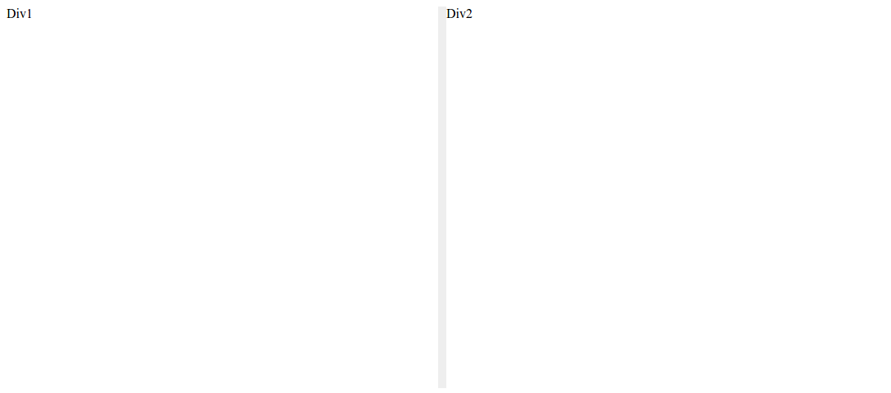
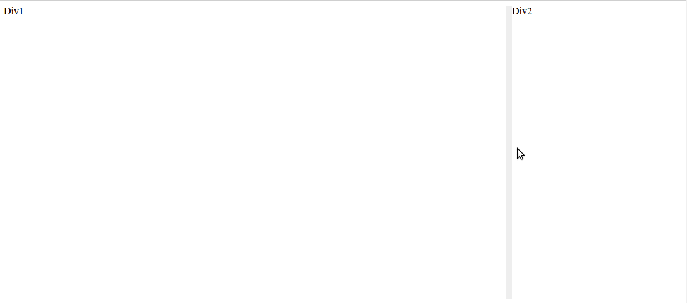

# SplitPane.js
Easily create adjustable views for your web app  
Can be fully controlled through your HTML class definitions

* [Getting started](#getting-started)
* [Optional settings](#optional-settings)
* [Demos](#demos)
* [Advanced Options](#advanced-options)


## Getting started
Add the split-pane class to your div  
Then add the pane-[horizontal/vertical] to specify direction

Call `SplitPane()` in your document ready function  
optional arguments are `SplitPane(rootElement, width)`

``` HTML
<div class="split-pane pane-horizontal">Div1</div>
<div class="split-pane pane-horizontal">Div2</div>
```
Produces


## Optional settings
Can add the options 
* **pane-min-[number]** where the number is the minimum % width/height that the column can be  
* **pane-minpx-[number]** where the number is the minimum pixels width/height that the column can be  
* **pane-weight-[number]** where the number is the weighted initial width/height of the column

Warning when using pane-minpx - the panes must all be able to fit into the window with their minimum pixels  
If this is not the case, strange behaviour may occur



## Demos
[Demo here](demo.html)

## Advanced options
Each divider has the class *pane-divider* so can be customised with css  
The each DOM object with the split-pane is given a Pane class in *object*.pane

## Pane class
`adjustSize(size)` - tries to resize the pane to the given size. In pixels if the argument is a number, and in percent if it is a string of numbers with "%" at the end